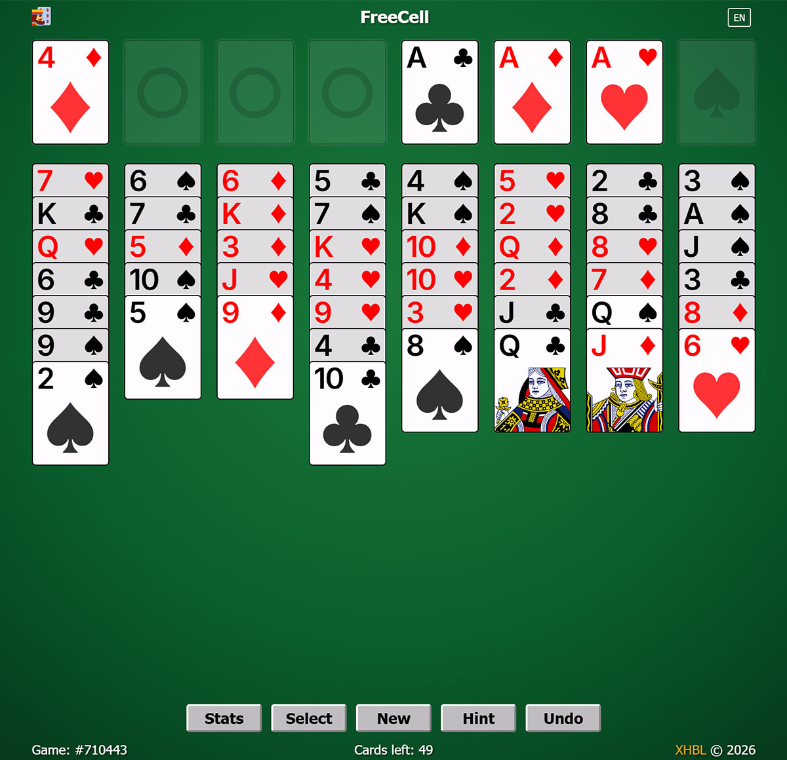

# About xjfcel

**A JavaScript-based classic FreeCell game**  

---

## Introduction

This is a robust FreeCell implementation written in JavaScript, designed for the browser environment. It brings the classic solitaire experience directly to your browser.

- **Authentic Recreation**: A near-perfect replica of the classic Windows FreeCell, using the original Microsoft shuffle algorithm for guaranteed solvable games.
- **Modern Web Interface**: Utilizes modern web technologies to deliver a clean, responsive, and visually appealing interface.
- **Custom Card Font**: Features a custom-designed font (XJCard) for rendering card numbers and suits.
- **Responsive Design**: Adapts to different screen sizes for optimal play on desktop and mobile devices.
- **Rich Visual Effects**: Includes smooth card movement animations and hint highlighting.

---

## Usage

### Online Play
Simply open the game in your web browser.

### Controls
- **Left Click**: Select a card / Place selected cards
- **Right Click**: Quick move to foundation
- **Double Click**: Quick move to foundation
- **Drag & Drop**: Move cards between columns
- **Hint Button**: Show possible moves
- **Undo Button**: Undo last move
- **Mobile**: Tap to select/place, long press for quick move

---

## Features

- **Windows FreeCell Compatible**: Uses the original Microsoft shuffle algorithm (1-1000000 game numbers)
- **Game Statistics**: Tracks played games, wins, win rate, win/lose streaks
- **Game Selection**: Replay any game by entering its game number
- **Hint System**: Shows valid moves with visual highlighting
- **Undo/Redo**: Full move history with unlimited undo
- **Responsive Layout**: Adapts to various screen sizes and orientations
- **Multi-language Support**: Chinese (Simplified) and English

---

## Development

### Build Instructions
- **Development**: `npm run dev`
- **Production Build**: `npm run build`

---

## License
This project is licensed under [MIT License](LICENSE). All code in this repository are free to use, modify, and distribute under the terms of this license.

---

## Contact
**E-mail**: [Send Email](mailto:newxhbl@hotmail.com?subject=[xjfcel]%20Inquiry)
