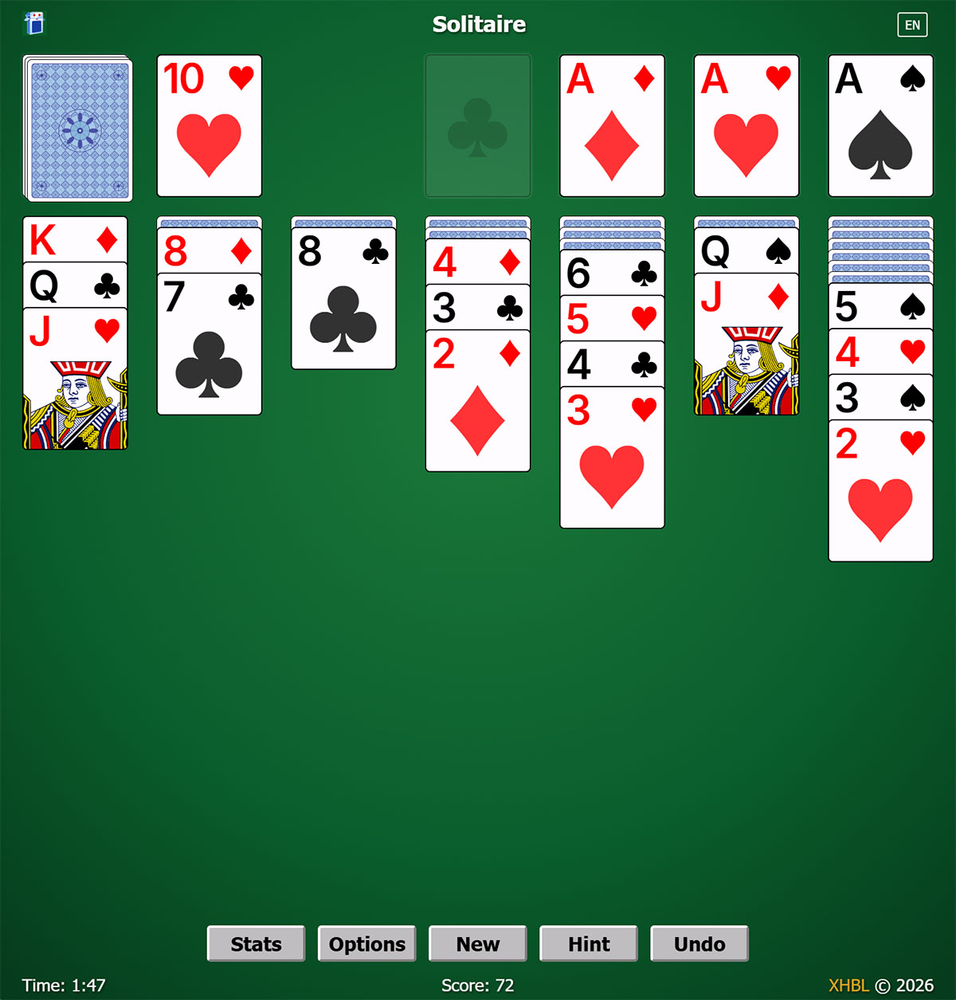

# About xjsoli

**A JavaScript-based classic Solitaire (Klondike) game**  

---

## Introduction

This is a robust Solitaire (Klondike) implementation written in JavaScript, designed for the browser environment. It brings the classic Windows Solitaire experience directly to your browser.

- **Authentic Recreation**: A near-perfect replica of the classic Windows Solitaire, using the original Microsoft shuffle algorithm for guaranteed game replayability.
- **Modern Web Interface**: Utilizes modern web technologies to deliver a clean, responsive, and visually appealing interface.
- **Custom Card Font**: Features a custom-designed font (XJCard) for rendering card numbers and suits.
- **Responsive Design**: Adapts to different screen sizes for optimal play on desktop and mobile devices.
- **Rich Visual Effects**: Includes smooth card movement animations, hint highlighting, and victory celebration.

---

## Game Rules

Solitaire (Klondike) is played with a standard 52-card deck. The goal is to move all cards to the four foundation piles, building each from Ace to King by suit.

### Setup
- **Stock**: 24 cards dealt face-down
- **Waste**: Empty initially, cards from stock are turned over here
- **Foundations**: 4 empty piles (one per suit)
- **Tableau**: 7 columns with 1-7 cards each, top card face-up

### Rules
- **Building on Tableau**: Build down in alternating colors (e.g., red 6 on black 7)
- **Building on Foundation**: Build up by suit from Ace to King
- **Moving Cards**: Move face-up cards or sequences between tableau columns
- **Empty Columns**: Only Kings can be placed on empty tableau columns
- **Drawing Cards**: Turn cards from stock to waste (Draw 1 or Draw 3 mode)

---

## Usage

### Online Play
Simply open the game in your web browser.

### Controls
- **Left Click**: Select a card / Place selected cards
- **Right Click**: Quick move to foundation
- **Double Click**: Quick move to foundation
- **Drag & Drop**: Move cards between columns
- **Hint Button**: Show possible moves
- **Undo Button**: Undo last move
- **New Game**: Start a new game with a random deal
- **Mobile**: Tap to select/place, long press for quick move

---

## Features

- **Draw Modes**: Supports both Draw 1 and Draw 3 modes
- **Auto-Collect**: Automatically collects cards to foundation when safe
- **Deadlock Detection**: Alerts when no moves are available
- **Game Statistics**: Tracks played games, wins, win rate, win/lose streaks, high scores
- **Game Selection**: Replay any game by entering its game number
- **Hint System**: Shows valid moves with visual highlighting
- **Unlimited Undo**: Full move history with unlimited undo
- **Responsive Layout**: Adapts to various screen sizes and orientations
- **Multi-language Support**: Chinese (Simplified) and English
- **Save/Load**: Automatically saves game progress

---

## Development

### Build Instructions
- **Development**: `npm run dev`
- **Production Build**: `npm run build`

---

## License
This project is licensed under [MIT License](LICENSE). All code in this repository are free to use, modify, and distribute under the terms of this license.

---

## Contact
**E-mail**: [Send Email](mailto:newxhbl@hotmail.com?subject=[xjsoli]%20Inquiry)
