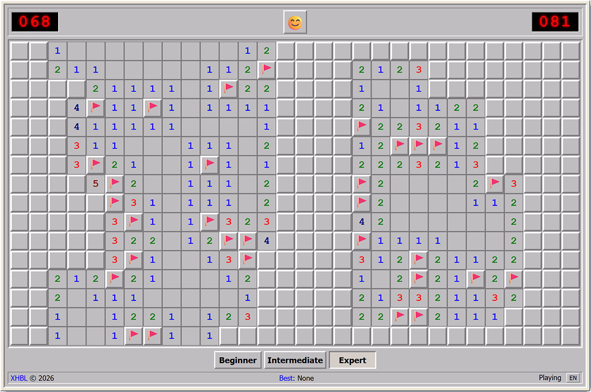

# About xjswpr

**A JavaScript-based classic Minesweeper game**  

---

## Introduction

This is a robust Minesweeper implementation written in JavaScript, designed for the browser environment. It brings the nostalgic puzzle experience directly to your browser.

- **Authentic Recreation**: A near-perfect replica of the classic Windows Minesweeper, faithfully preserving the original mechanics, logic, and difficulty levels.
- **Modern Web Interface**: Utilizes modern web technologies to deliver a clean, responsive, and visually appealing interface.
- **Classic Gameplay**: Includes all the essential features you remember—left-click to reveal, right-click to flag, and "chording" (double-click) to clear areas quickly.
- **Progressive Web App (PWA)**: Supports installation as a PWA for a native-like experience on desktop and mobile devices.
- **Responsive Design**: Adapts to different screen sizes for optimal play on desktop and mobile devices.

---

## Usage

### Online Play
Simply open the game in your web browser.

### Installation as PWA (need to deploy using https)
1. Open the game in Chrome or Edge browser
2. Click the "Install" button in the address bar
3. The game will be installed as a standalone app on your device

### Controls
- **Left Click**: Reveal a cell
- **Right Click**: Place/remove a flag
- **Double Click** (on revealed number): Clear surrounding cells when flags match the number
- **Mobile**: Tap to reveal, long press to place/remove a flag

---

## Features

- **Three Difficulty Levels**: Beginner (9x9, 10 mines), Intermediate (16x16, 40 mines), Expert (16x30, 99 mines)
- **Best Time Tracking**: Records and displays your best completion times for each difficulty level
- **Game Status Indicators**: Shows game state (ready, playing, game over, win)
- **Visual Feedback**: Provides clear visual cues for mines, flags, and numbers

---

## Development

### Build Instructions
- **Regular Build**: `npm run build`
- **PWA Build**: `npm run build:pwa`

---

## License
This project is licensed under [MIT License](LICENSE). All code in this repository are free to use, modify, and distribute under the terms of this license.

---

## Contact
**E-mail**: [Send Email](mailto:newxhbl@hotmail.com?subject=[xjswpr]%20Inquiry)  

